# E-Commerce App

Developed an E-Commerce web application using C# and ASP.NET Core Web API, following Clean Architecture principles. Implemented Repository, Unit of Work, and Specification patterns for maintainable and scalable code. Used Entity Framework Core as the ORM for database operations with SQL Server. Integrated ASP.NET Identity for secure login, registration, and role-based authorization. Key features include product pagination, sorting, searching, and filtering; shopping basket stored in Redis cache; and real-time notifications using SignalR WebSockets. Payment processing was handled via Stripe, supporting the latest EU 3D Secure standards. The frontend was built with Angular, utilizing reusable components, directives, pipes, services, guards, and reactive forms, along with lazy-loaded routes for performance optimization. The user interface was styled using Angular Material and Tailwind CSS.

## Frontend Project

[e-commerce-app](https://github.com/pranto1209/e-commerce-app)

## Backend Project

[ECommerceApp](https://github.com/pranto1209/ECommerceApp)

## Screenshots
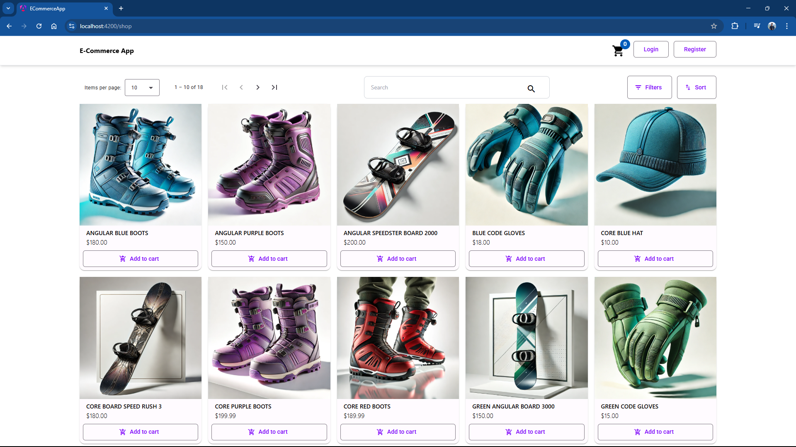

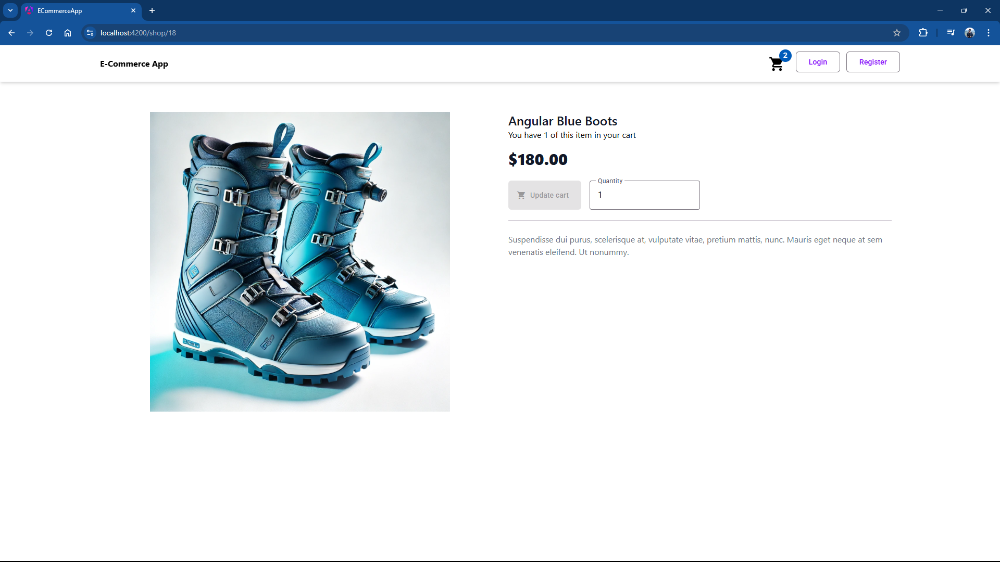


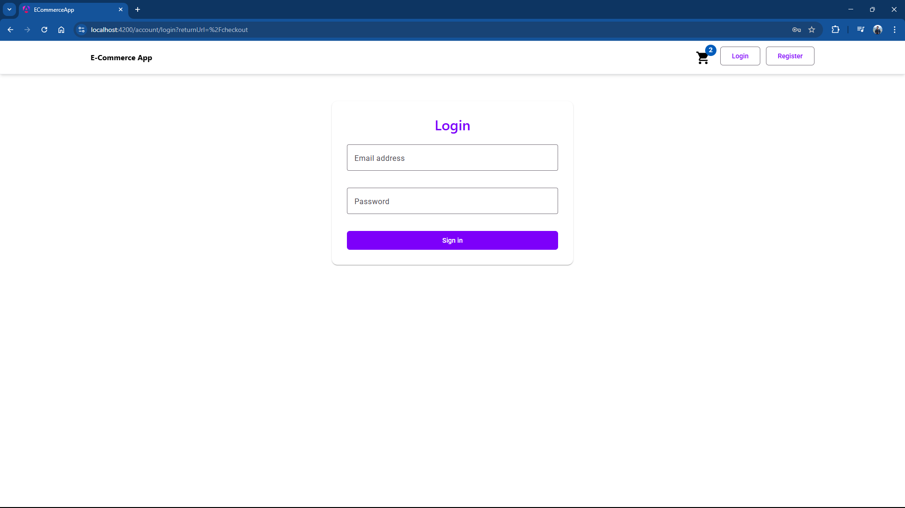

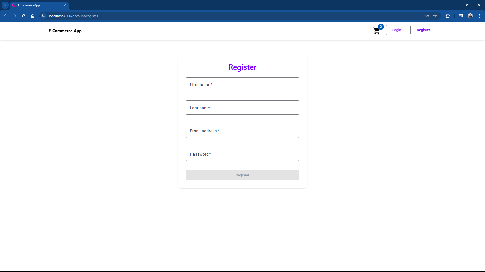

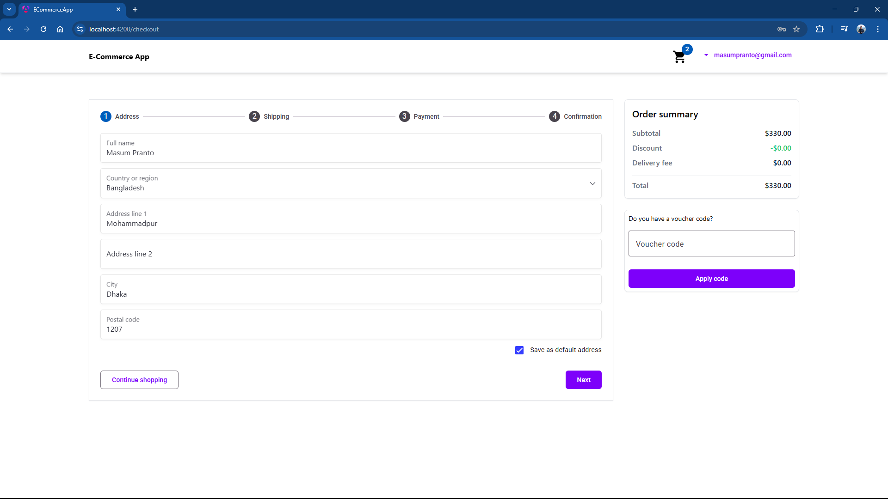

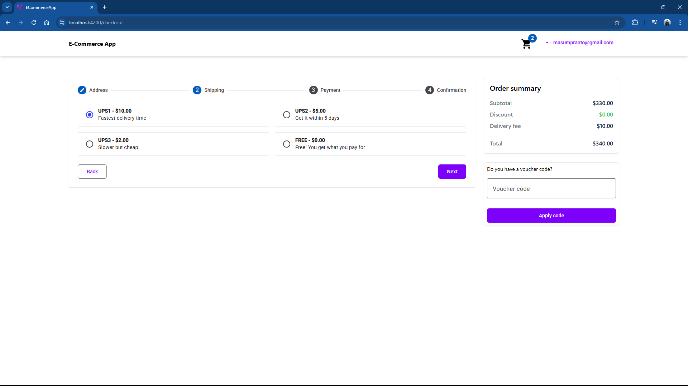

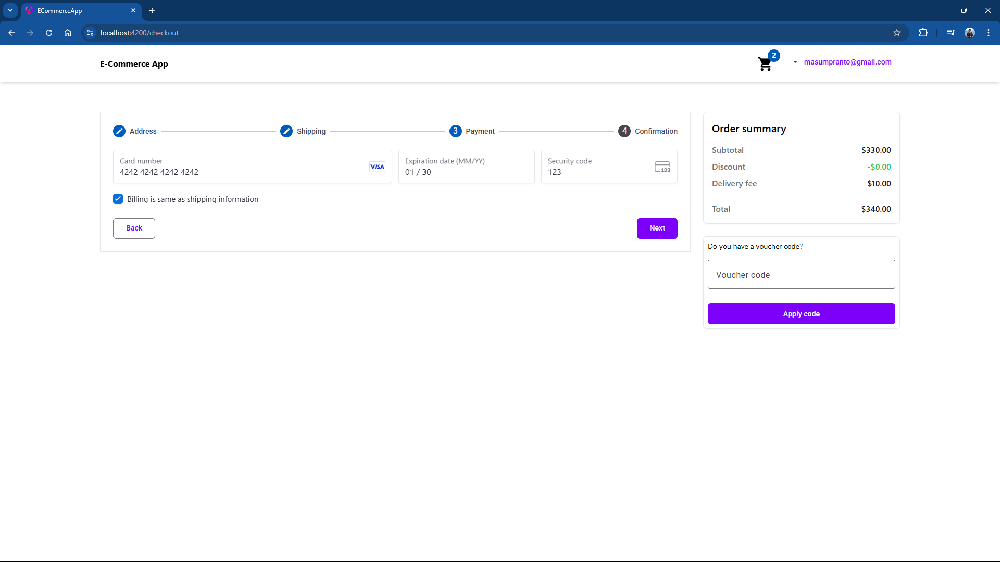

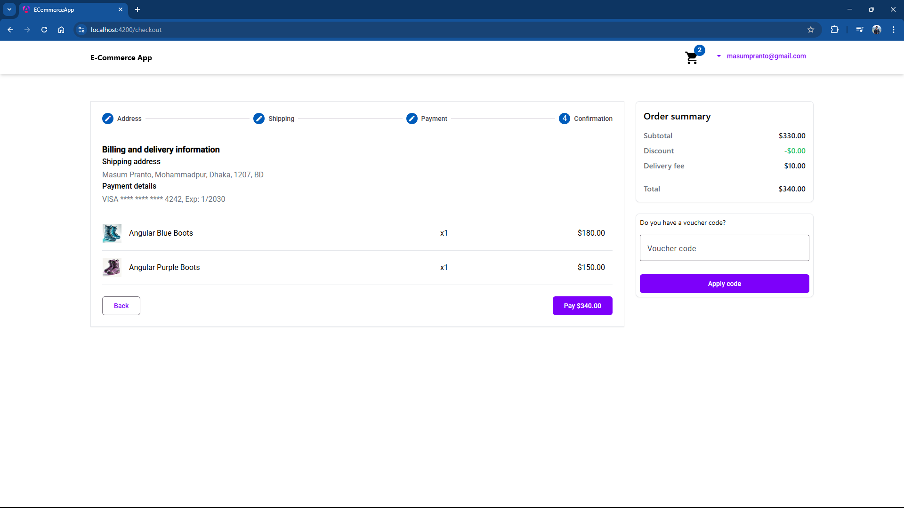

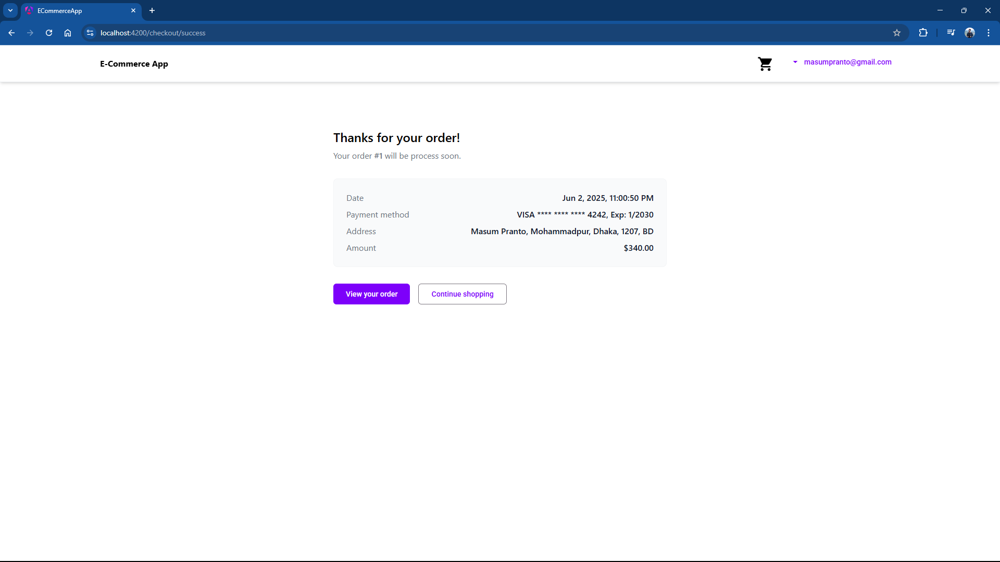


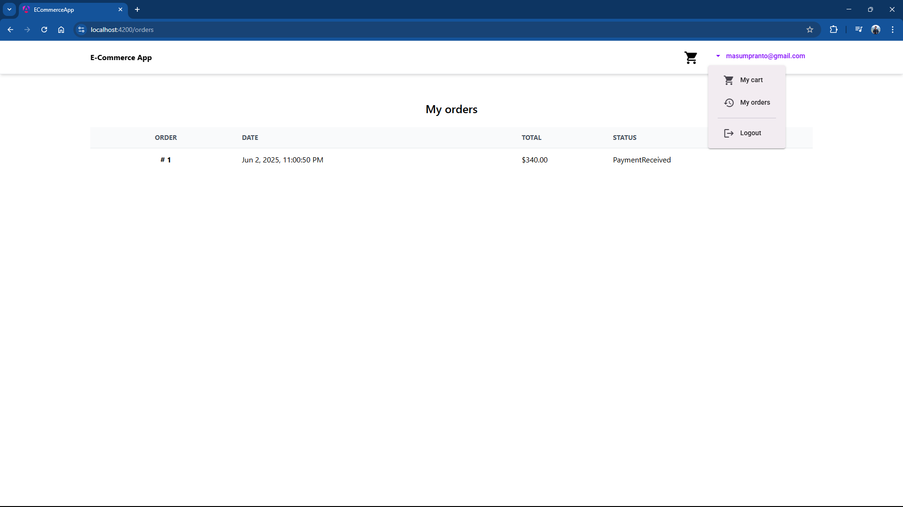

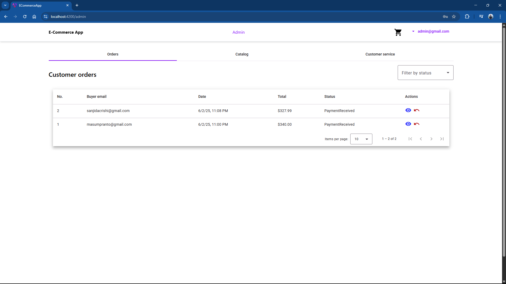

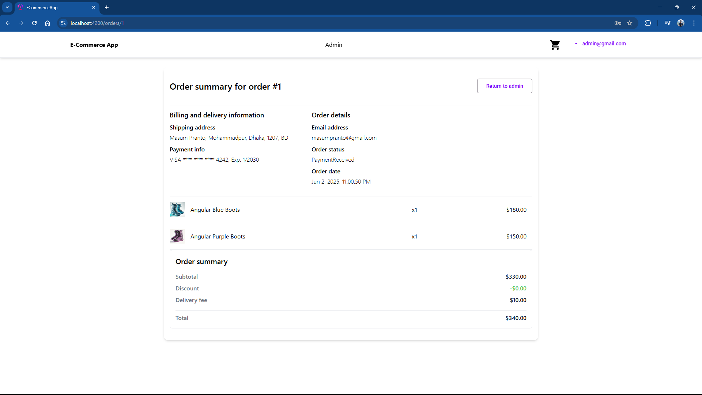

## SSL

* To run the project in HTTPS, install mkcert using the instructions provided in its repository [here](https://github.com/FiloSottile/mkcert). Then run command:

```bash
cd ssl

.\mkcert localhost
```

* Run in HTTPS (Default in this project)

```bash
ng serve --ssl true
```

* Run in HTTP

```bash
ng serve --ssl false
```

## Stripe

* Setup a local listener

```bash
.\stripe login

.\stripe listen --forward-to https://localhost:5001/api/payments/webhook -e payment_intent.succeeded
```

* Stripe test cards are available [here](https://docs.stripe.com/testing#cards) to pay for the orders
