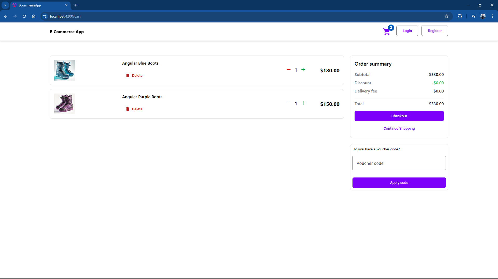

# ECommerceApp

This project was generated with [Angular CLI](https://github.com/angular/angular-cli) version 18.0.7.

## Development server

Run `ng serve` for a dev server. Navigate to `http://localhost:4200/`. The application will automatically reload if you change any of the source files.

## Code scaffolding

Run `ng generate component component-name` to generate a new component. You can also use `ng generate directive|pipe|service|class|guard|interface|enum|module`.

## Build

Run `ng build` to build the project. The build artifacts will be stored in the `dist/` directory.

## Running unit tests

Run `ng test` to execute the unit tests via [Karma](https://karma-runner.github.io).

## Running end-to-end tests

Run `ng e2e` to execute the end-to-end tests via a platform of your choice. To use this command, you need to first add a package that implements end-to-end testing capabilities.

## Further help

To get more help on the Angular CLI use `ng help` or go check out the [Angular CLI Overview and Command Reference](https://angular.dev/tools/cli) page.

## SSL

* If you wish to run the Angular app in development mode you will need to install a self signed SSL certificate.  The client app is using an SSL certificate generated by mkcert.   To allow this to work on your computer you will need to first install mkcert using the instructions provided in its repo [here](https://github.com/FiloSottile/mkcert), then run the following command:

```bash
cd client/ssl
.\mkcert localhost
```

* Run in https

```bash
ng serve --ssl true
```

## Stripe

* To use the Stripe webhook you will also need to use the StripeCLI, and when you run this you will be given a whsec key which you will need to add to the appsettings.json.   To get this key and instructions on how to install the Stripe CLI you can go to your Stripe dashboad ⇒ Developers ⇒ Webhooks ⇒ Add local listener.   The whsec key will be visible in the terminal when you run Stripe.

* Once you have the Stripe CLI you can then run this so it listens to stripe events and forward them to the .Net API:

```bash
.\stripe login

.\stripe listen --forward-to https://localhost:5001/api/payments/webhook -e payment_intent.succeeded
```

## Screenshots





